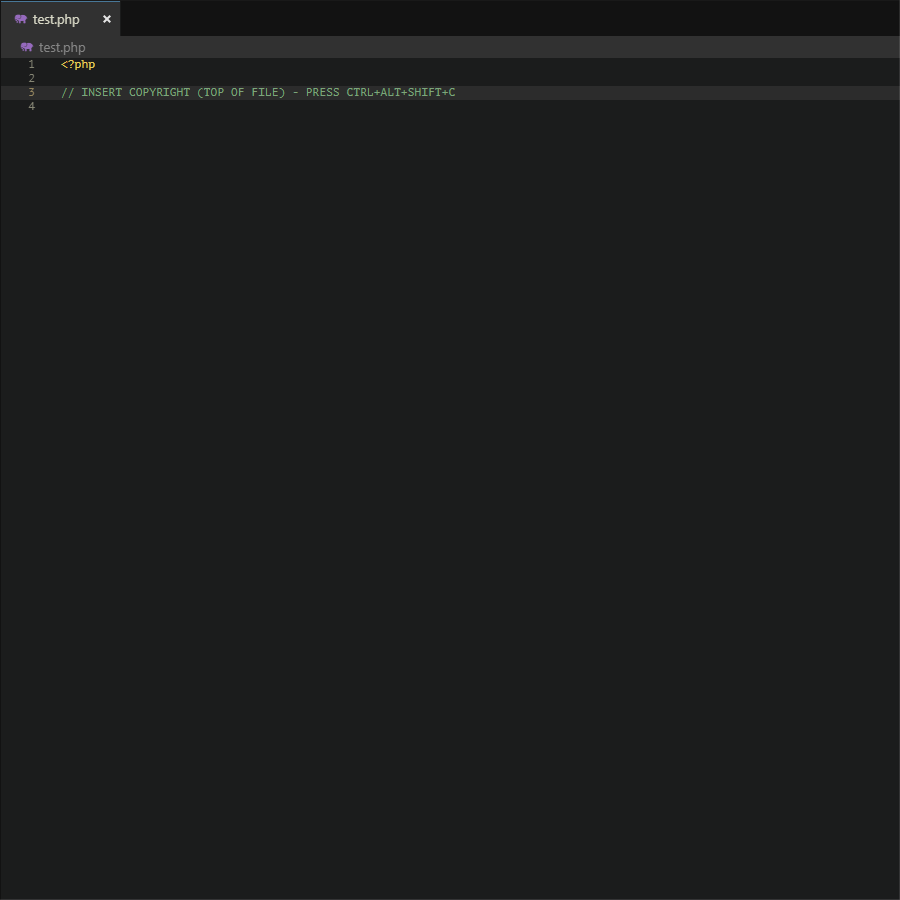

<!-- RICORDATI: QUESTO FILE E' ASSEMBLATO DAL TUO SCRIPT - NON MODIFICARLO DA QUI -->
<!-- 2019/06/22 16:16:25.171 -->

&nbsp;
&nbsp;
&nbsp;
&nbsp;

# Version Boss - v. 1.3.5

Versioning like a Boss - Semantic Versioner for Scripting Languages: Insert and Update Version, according to http://semver.org directives, Copyrights of file, Distribution License, and save-it using shortcuts.

## Release Notes for version 1.3.5

> Note: [`Development`] sections in *Changelog* are addressed to the developer to remind him of any important changes that occurred during the writing of the code and do not always concern improvements made to the extension or to the theme.

- [`Development`] Optimized some parts of **Version Boss** Extension code;
- [`Development`] Added function that generate **Version Boss** Extension badges in `README.md`.

See `Changelog` for previous versions.

### Very Important Informations for Upgrade to `Version Boss v. 1.2.0` and above

1. **`PLEASE UPDATE BOUNDARIES STRUCTURE IN YOUR SCRIPTS`**: from version `1.2.0` was changed structure of boundaries from `<!#(.+)#!>` to `<!#(.+)>` and `</#(.+)#/>` to `</#(.+)>` (e.g.: `<!#FV#!>1.2.3456-beta.3</#FV#/>` to `<!#FV>1.2.3456-beta.3</#FV>`. Even all others boundaries are changed in this pattern!);
1. **`PLEASE UPDATE YOUR SETTINGS`**: from version `1.2.0` was removed `Version Update On Pattern Match Only First` and  changed rule of `Version Update On Pattern Match` from `false` / `true` to `False` / `True` / `Only First Occurrence` (default: `False`);

---

## Features

**Version Boss** is an extension to keep the versions of script files up to date according to the [semver.org](http://semver.org) directives (`Major.Minor.Patch-Channel.ChannelVersion` eg: `1.2.3456-beta.3`).

> Tip: I suggest you also use one of my [VSCode Themes](https://marketplace.visualstudio.com/search?term=publisher%3A%22Nicola%20Granata%22&target=VSCode&category=Themes&sortBy=Name)!

**Version Boss**, using shortcuts, can:
- Insert and Update (step-up and step-down) File Version;
- Insert Copyrights infos in multiline comments(1)  and other infos about Licensing and file stats;
- Insert Copyrights infos in JavaScript Object or PHP Associative Array and in JSON stringified object for all other languages;
- Easily switch between Licenses (and customize it in Settings);

- `Warning`: **Version Boss** was tested with `JavaScript` and `PHP` files but will be work on most of scripting languages: In *future versions*, I will try to refine the output for the various programming languages.

---

## **Version Boss** Demo

## Some recommendations before start using *Version Boss*

The extension is almost entirely customizable (`1`), at least until sufficient feedback is available to eliminate unnecessary customizables settings. 
It is good to leave the default settings, except for that which may cause conflicts with your code, and customize only: 

- Try one of my [VSCode Themes](https://marketplace.visualstudio.com/search?term=publisher%3A%22Nicola%20Granata%22&target=VSCode&category=Themes&sortBy=Name)!
- Version Boss »  Copyrights » *[all settings for this group]*.

Consider also setting :
- Version Boss »  Settings »  Set Variable Name For Copyrights Infos Associative Array;
- Version Boss »  Settings »  Auto Save After Step Up;
- Version Boss »  Settings »  Show Information Message;
- Version Boss »  Settings »  Copyrights »  Owner (can be Author, Company or both);
- Version Boss »  Settings »  Copyrights »  Set Licenses List (set the list of licenses, placing the one you use most in the first place);
- Version Boss »  Settings »  Semver Update On Pattern Match (`2`);

---

Notes:

1. Better to prepare all the options before an active development, to be aware of possible conflicts.

2. *Semver Update On Pattern Match* can recognize any pattern similar to "`Major.Minor.Patch[-Channel[.ChannelVersion]]`" (eg: `1.2.3456-beta.3`) enclosed in pair double-quote `"` or pair single-quote `'` (without spaces in between). 
If you plan to use similar pattern in portion of your code, this may be in conflict with **Version Boss** pattern recognition. In this case you can (one of them):
	1. ~~limit step only to first occurence (*Settings » Semver » Update On Pattern Match Only First*: `true`)~~ limit step only to first occurence (*Settings » Semver » Update On Pattern Match*: `Only First Occurrency`);
	2. in your string  add `#` or `any non digit char` as first char (eg: `1.2.3456-beta.3` -> `#1.2.3456-beta.3`, useful if you maintain track of features/bug fixes in comments to code);
	3. disable *Version Boss »  Settings »  Semver Update On Pattern Match*.

---

## Quick Start

> TIP 1: Make a Variable `version=""` in your file and assign version by press `CTRL+ALT+SHIFT+B` (version number with boundaries).

> Tip 2: With  `CTRL+ALT+SHIFT+S` you can step-up Patch version and save the file at the same time. See `Contributions` for other **Version Boss** shortcuts.

> Tip 3: if you want to save file at step-up/step-down whenever you change any of the `Major/Minor/Patch/Channel/ChannelVersion` enable *Version Boss »  Settings »  Auto Save After Step Up*.

> Tip 4: if you use multiple instances of the file version group, when you update the version, all instances will be updated with the highest value found between them.

> Tip 5: by set `Version Update On Pattern Match` you can versioning even functions (with `False`, from first instance of version string, with `Only First Occurrence` enabled, from second instance of version string). To update them, move cursor to line with function version. `Warning`: if you store multiple version strings (not in boundaries) in same line, only first string after cursor position will be updated. If there is only one semver matching string in line, cursor position don't affect step-up/down: the string will be updated anyway. With `False`, all strings that match semver pattern enclosed in quotes can be updated individually.  With `Only First Occurrence` enabled, the first string without boundaries will be aligned to file version. From second string that match semver pattern, update will be only if you move cursor in line. Form **Version Boss** v. `1.2.9`, is possible to step version with leading `^` (e.g. `"^1.35.0"`).

---

## History

I wrote the first draft for *Eclipse Monkey*, to help me manage the versioning of my JS and PHP scripts.
After updates to Eclipse, Monkey was no longer supported and was replaced by EASE. I used old versions of Eclipse for quite some time, so as not to abandon the convenience of automatic versioning.
Although I had subsequently started writing the code for EASE, I feared that what happened with Monkey would happen again and, consequently, I decided to do without the automatic versioning for a while (it was driving me crazy) until I have decided to abandon the slowness of Eclipse in favor of VSCode.

### Off-standard functions

The first scripts for Monkey did not use the SemVer directives, simply because I used versioning for internal reference, so I implemented the Minor Version increase on passing the Patch Version `99`, and the Major Version on passing the Minor Version `99`. 
It was not implemented not even the use of the channel. Since, personally, I found this method comfortable, although not correct, I decided to add the possibility to choose whether or not to use the step-up of the echelon after reaching threshold(`1`) for the current echelon (e.g. limit:`1000` -> from `Patch 999` to `Patch 1000` step-up Minor Version of `+1` and set Patch version to `0`) and to be `able to set the limit to be reached before carrying out the progress of the next echelon` for `each echelon` (eg. limit for Minor Version before step-up Major Version set to `100`, and limit for Patch Version to step-up `+1` Minor Version set to `1000`). 
The use of this function is strongly discouraged after the release of the first public version of ypur app, but as long as you manage your scripts yourself, I don't think anyone can hurt you. Other non-standard functions are the `step-downs` for each echelon.

---

Notes:

1. In step-down mode, for security reasons, the levels are always independent of the limits.

---

## Shortcuts Reference

|Command Palette|Windows|Mac|
|---|---|---|
| *Version Boss*: Patch - insert or step-up and save (autosave ever enabled) | `CTRL+ALT+SHIFT+S` | `CTRL+OPTION+SHIFT+S` |
| *Version Boss*: Channel Ver. - insert or step-up | `CTRL+ALT+SHIFT+T` | `CTRL+OPTION+SHIFT+T` |
| *Version Boss*: Channel - insert or step-up | `CTRL+ALT+SHIFT+R` | `CTRL+OPTION+SHIFT+R` |
| *Version Boss*: Patch - insert or step-up | `CTRL+ALT+SHIFT+E` | `CTRL+OPTION+SHIFT+E` |
| *Version Boss*: Minor - insert or step-up | `CTRL+ALT+SHIFT+W` | `CTRL+OPTION+SHIFT+W` |
| *Version Boss*: Major - insert or step-up | `CTRL+ALT+SHIFT+Q` | `CTRL+OPTION+SHIFT+Q` |
| *Version Boss*: Channel Ver. - insert or step-down | `CTRL+ALT+SHIFT+P` | `CTRL+OPTION+SHIFT+P` |
| *Version Boss*: Channel - insert or step-down | `CTRL+ALT+SHIFT+O` | `CTRL+OPTION+SHIFT+O` |
| *Version Boss*: Patch - insert or step-down | `CTRL+ALT+SHIFT+I` | `CTRL+OPTION+SHIFT+I` |
| *Version Boss*: Minor - insert or step-down | `CTRL+ALT+SHIFT+U` | `CTRL+OPTION+SHIFT+U` |
| *Version Boss*: Major - insert or step-down | `CTRL+ALT+SHIFT+Y` | `CTRL+OPTION+SHIFT+Y` |
| *Version Boss*: Align all version numbers to max version number without step-up/down | `CTRL+ALT+SHIFT+A` | `CTRL+OPTION+SHIFT+A` |
| *Version Boss*: Force insert version, with boundaries, at caret position | `CTRL+ALT+SHIFT+B` | `CTRL+OPTION+SHIFT+B` |
| *Version Boss*: Force insert version, without boundaries, at caret position | `CTRL+ALT+SHIFT+V` | `CTRL+OPTION+SHIFT+V` |
| *Version Boss*: Forces insert version, without boundaries, in the position of approach with the main ban of char (prevent the global passage up / down) | `CTRL+ALT+SHIFT+N` | `CTRL+OPTION+SHIFT+N` |
| *Version Boss*: Copyrights - insert or update | `CTRL+ALT+SHIFT+C` | `CTRL+OPTION+SHIFT+C` |
| *Version Boss*: License - insert or update | `CTRL+ALT+SHIFT+L` | `CTRL+OPTION+SHIFT+L` |
| *Version Boss*: Get Copyrights Informations and put it into an PHP Associative Array or JS Object or JSON string (by file extension) | `CTRL+ALT+SHIFT+J` | `CTRL+OPTION+SHIFT+J` |
| *Version Boss*: Help - Generate Help in Console log (usefull only for development of this extension) | `CTRL+ALT+SHIFT+H` | `CTRL+OPTION+SHIFT+H` |

# Settings

This extension contributes the following settings:

### Version Boss »  Settings »  Set Variable Name For Copyrights Infos Associative Array
* Set the name of the default variable to insert the Copyrights Infos Array  into the code.

> `PHP Language Tip`: do not use the prefix **`$`**: it will be added automatically based on the programming language of the file (if inserted, will be ignored in PHP files but not in others programming languages). You can use an array item (e.g. `glob_env["copyrights_infos"]`).

`Warning`: because of complexity of programming languages, this field not use pattern matching to check malformed typing. Please, pay attention!

> `versionBoss.settings.setVariableNameForCopyrightsInfosAssociativeArray` [type: `string`] 
---
### Version Boss »  Settings »  Check If Variable Name For Copyrights Infos Associative Array Exists
* Check if the Variable Name For Copyrights Storage already exists and prevents writing to avoid overrides.

When set to `false`, overrides are permitted (naturally you could change the variable name after insert).

> `versionBoss.settings.checkIfVariableNameForCopyrightsInfosAssociativeArrayExists` [type: `boolean`] 
---
### Version Boss »  Settings »  Set Default Quoting Char For Generated Code
* Set the default quoting char to insert generated code into your code (e.g. Copyrights Infos Array).

> `versionBoss.settings.setDefaultQuotingCharForGeneratedCode` [type: `string`] 
---
### Version Boss »  Settings »  Version Use Channels Strict Match
* Enable the strict matching of channel part of semver string.

- `true`: only part of semver string matching the string of channels availabes in *Version Boss » Settings » Set Channels List* is recognized and updated

- `false`: any channel string in semver full pattern is recognized and fixed/updated (e.g. `<!#FV> 1.25.0-roadrunner.1 </#FV>` -> `<!#FV> 1.25.0-alpha.1</#FV>`)

> `versionBoss.settings.versionUseChannelsStrictMatch` [type: `boolean`] 
---
### Version Boss »  Settings »  Version Update On Pattern Match
* Enable Version Update even without a boundaries. Version string must be enclosed in double-quote or single-quote.

`Warning`: this may conflict with your code if you use patterns similar to `Major.Minor.Patch [-Channel [.ChannelVersion]]` (e.g. `"1.0.0-alpha.2"`) for different purposes than file versioning. You can insert a symbol before first digit to prevent update of a specific matching string (eg. `1.23.45` -> `#1.23.45`).

Update only first occurrence of semver string enclosed in pair of double-quote or single-quote (e.g. "`1.23.45`") `in page` or `in line`.

On update semver if line where is caret position not match semver pattern, the first occurrence in page and all instances in boundaries (e.g. `<!#FV> 1.25.0-roadrunner.1 </#FV>`) are updated.

On update semver, if line where is caret position match semver pattern:

1. `once`: the occurrence is updated; 

2. `more than once`: only first occurrence **after caret position** is updated.

3. `more than once` but caret position after lastest match: to avoid unwanted update, no one occurrence is updated.

> `versionBoss.settings.versionUpdateOnPatternMatch` [type: `string`] 
---
### Version Boss »  Settings »  Char For Banned Version
* Char for banned version for Changelog or for Function versioning (e.g. `#` -> `#1.23.45`).

> `versionBoss.settings.charForBannedVersion` [type: `string`] 
---
### Version Boss »  Settings »  Auto Save After Step Up
* Save file after each step up.

> `versionBoss.settings.autoSaveAfterStepUp` [type: `boolean`] 
---
### Version Boss »  Settings »  Insert Quotes With File Version
* Insert File Version (without boundaries) with o without quotes.

> `versionBoss.settings.insertQuotesWithFileVersion` [type: `boolean`] 
---
### Version Boss »  Settings »  Set First Version
* Set Fisrt version to use when you start versioning `Major.Minor.Patch[-(any Channel[.(any ChannelVersion > 0)]]`

e.g.: `1.0.0`,`0.0.0`, `1.0.0-beta.1`.

> `versionBoss.settings.setFirstVersion` [type: `string`] 
---
### Version Boss »  Settings »  Set Channels List
* Channels (except `Release` wich no have any abbreviation in semver.org directives - multiple data separated by comma `,`).

e.g. `alpha`, `beta`,[`...`], `RC`,`RTM`,`GA`, `RTW`.

`Warning 1`: only words with a-z chars and comma are valid values: the other symbols will be ignored.

> `versionBoss.settings.setChannelsList` [type: `string`] 
---
### Version Boss »  Settings »  Show Information Message
* Show Information Message when action is done.

> `versionBoss.settings.showInformationMessage` [type: `boolean`] 
---
### Version Boss »  Settings »  Show Warning And Error Message
* Show Warning and Errors Messages when action could not be done.

> `versionBoss.settings.showWarningAndErrorMessage` [type: `boolean`] 
---
### Version Boss »  Settings »  Reset Childs On Step Up
* Set `0` to childs when step-up Minor or Major version.

e.g. `true`:
1. Step-up Major = `1.23.45` -> **`2.0.0`**;
2. Step-up Minor = `1.23.45` -> `1.`**`24.0`**;

e.g. `false`:
1. Step-up Major = `1.23.45` -> **`2`**`.23.45`;
2. Step-up Minor = `1.23.45` -> `1.`**`24`**`.45`.

> `versionBoss.settings.resetChildsOnStepUp` [type: `boolean`] 
---
### Version Boss »  Settings »  Set Channel To Alpha On Major Version Step Up
* Set channel to `alpha` when step-up Major version.

e.g. `true`:
1. Step-up Major = `1.23.45-RC.3` -> **`2.0.0-alpha`**;

e.g. `false` :
1. Step-up Major = `1.23.45-RC.3` -> **`2.0.0`** (with `Reset Childs On Step Up ` set to `true`);
2. Step-up Major = `1.23.45-RC.3` -> **`2.0.0-RC.3`** (with `Reset Childs On Step Up ` set to `false`).

> `versionBoss.settings.setChannelToAlphaOnMajorVersionStepUp` [type: `boolean`] 
---
### Version Boss »  Settings »  Non Standard »  Step Up Channel On Channel Version Limit Reach
* `Warning! - is not a standard`: Step Up Channel when Channel Version reach this limit (`0` for no step-up).

e.g. Version limit: `3`: Steping up Channel Version from `1.23.45-beta.3` to `1.23.45-beta.4` make  **`1.23.45-RC`**.

> `versionBoss.settings.nonStandard.stepUpChannelOnChannelVersionLimitReach` [type: `integer`] 
---
### Version Boss »  Settings »  Non Standard »  Step Up Minor Version On Patch Version Limit Reach
* `Warning! - is not a standard`: Step Up Minor Version when Patch Version reach this limit (`0` for no step-up).

e.g. Version limit: `99`: Steping up Patch Version from `1.23.99` to `1.23.100` make  **`1.24.00`**.

> `versionBoss.settings.nonStandard.stepUpMinorVersionOnPatchVersionLimitReach` [type: `integer`] 
---
### Version Boss »  Settings »  Non Standard »  Step Up Major Version On Minor Version Limit Reach
* `Warning! - is not a standard`: Step Up Major Version when Minor Version reach this limit (`0` for no step-up).

e.g. Version limit: `99`: Steping up Patch Version from `1.99.45` to `1.100.45` make  **`2.00.00`**.

> `versionBoss.settings.nonStandard.stepUpMajorVersionOnMinorVersionLimitReach` [type: `integer`] 
---
### Version Boss »  Boundaries »  Tag Enclosers
* Chars which enclose the boundary.

e.g. `<` and `>` in `<!#FV>`1.23.45`</#FV>`.

> `versionBoss.boundaries.tagEnclosers` [type: `string`] 
---
### Version Boss »  Boundaries »  Boundary Identity Char
* Symbol which set the identity of open/close boundary (e.g. `#` in `<!#FV>`).

> `versionBoss.boundaries.boundaryIdentityChar` [type: `string`] 
---
### Version Boss »  Boundaries »  Boundary Open Char
* Symbol which set open boundary (set to `not equal` to Boundary Close Char, or it will be substituted with another one, e.g. `!` in  `<!#FV>`).

> `versionBoss.boundaries.boundaryOpenChar` [type: `string`] 
---
### Version Boss »  Boundaries »  Boundary Close Char
* Symbol which set close boundary (set to `not equal` to Boundary Open Char, or it will be substituted with another one, e.g. `/` in `</#FV>`).

> `versionBoss.boundaries.boundaryCloseChar` [type: `string`] 
---
### Version Boss »  Boundaries »  Data String IDs »  File Name
* String to recognize and update or insert File Name boundaries and values.

> `versionBoss.boundaries.dataStringIDs.fileName` [type: `string`] 
---
### Version Boss »  Boundaries »  Data String IDs »  File Birth
* String to recognize and update or insert File Birth boundaries and values.

> `versionBoss.boundaries.dataStringIDs.fileBirth` [type: `string`] 
---
### Version Boss »  Boundaries »  Data String IDs »  File Version
* String to recognize and update or insert File Version boundaries and values.

> `versionBoss.boundaries.dataStringIDs.fileVersion` [type: `string`] 
---
### Version Boss »  Boundaries »  Data String IDs »  File Modification Time
* String to recognize and update or insert File Modification Time boundaries and values.

> `versionBoss.boundaries.dataStringIDs.fileModificationTime` [type: `string`] 
---
### Version Boss »  Boundaries »  Data String IDs »  Copyrights
* String to recognize or insert File Copyrights boundaries and values.

***Note***:

for preserve data manually inserted in Copyrights block, system prevent to update it accidentally by pressing shortcuts. You have to delete the Copyrigths block to inserert new data (at least, if you want to leave old data for your convenience, delete only the boundaries tags <!#CR#!> and </#CR#/>). This is not valid for all other infos (even in Copirights block) wich is enclosed in boundaries (e.g. File Version, File Mod Time are ever updated,  Licensing only on pressing shortcuts).

> `versionBoss.boundaries.dataStringIDs.copyrights` [type: `string`] 
---
### Version Boss »  Boundaries »  Data String IDs »  Licenses
* String to recognize and update or insert File License boundaries and values.

> `versionBoss.boundaries.dataStringIDs.licenses` [type: `string`] 
---
### Version Boss »  Boundaries »  Data String IDs »  Licenses Url
* String to recognize and update or insert File License URL boundaries and values.

> `versionBoss.boundaries.dataStringIDs.licensesUrl` [type: `string`] 
---
### Version Boss »  Boundaries »  Data String IDs »  Licenses Clarification
* String to recognize and update or insert File License Description boundaries and values.

> `versionBoss.boundaries.dataStringIDs.licensesClarification` [type: `string`] 
---
### Version Boss »  Settings »  Copyrights »  Insert Extension Author Credits
* If you want, can include credits of the author of this extension: it will occupy only one row at bottom of yours copyrights informations.

> `versionBoss.settings.copyrights.insertExtensionAuthorCredits` [type: `boolean`] 
---
### Version Boss »  Settings »  Copyrights »  Row Max Length
* Length of the rows of Copyrights in columns (80 columns suggested in Coding Standard Directives).

> `versionBoss.settings.copyrights.rowMaxLength` [type: `integer`] 
---
### Version Boss »  Settings »  Copyrights »  Header
* Header of Copyrights box.

> `versionBoss.settings.copyrights.header` [type: `string`] 
---
### Version Boss »  Settings »  Copyrights »  File And Licenses Infos Header
* Header of File and Licenses Informations box.

> `versionBoss.settings.copyrights.fileAndLicensesInfosHeader` [type: `string`] 
---
### Version Boss »  Settings »  Copyrights »  Set Licenses Pattern Url
* This is the path to the site or file where you can store information about the license of your script.

By default, it use [SPDX site](https://spdx.org/licenses/)  data and the special keyword *`{LICENSE_ID}`* thath will be dinamically converted with license-id you choosed in url of ***SPDX***. For this, you have to insert in *Settings » Copyrights » Set Licences List* the exact IDs found at [SPDX Site](https://spdx.org/licenses/) in 2nd column (named *Identifier*), e.g. `LGPL-3.0-or-later` will produce the following url `https://spdx.org/licenses/LGPL-3.0-or-later.html`. Url can be customized (e.g. `https://example.com/get_lic.php?somevar=someval&mylicense={LICENSE_ID}`).

> `versionBoss.settings.copyrights.setLicensesPatternUrl` [type: `string`] 
---
### Version Boss »  Settings »  Copyrights »  Set Licenses List
* Licenses in which, generally, you want to distribute your software (separate licenses by comma `,` and structure `LICENSE_NAME_OR_ID` | `LICENSE_URL` | `LICENSE_CLARIFICATION` using pipe `|`). Value before first comma is default.

1. `LICENSE_NAME_OR_ID` : use id from [SPDX site](https://spdx.org/licenses/) or your personal id or name (name will be converted in ID-like);

2. `LICENSE_URL`: url of your license. If empty, value in *Set Licenses Pattern Url* will be used;

3. `LICENSE_CLARIFICATION`: Short clarification about licenses. If empty, value in *Set Licenses Default Clarification* will be used.

*To get Licenses IDs*: go to [SPDX Site](https://spdx.org/licenses/), get strings (even more than one) from 2nd column (named *Identifier*) and enter it in this field (separated by comma `,`).

> `versionBoss.settings.copyrights.setLicensesList` [type: `string`] 
---
### Version Boss »  Settings »  Copyrights »  Set Licenses Default Clarification
* Licenses clarification about use of file and its contents. This is default clarification. To set clarification for each license, please use *Set Licenses List*.

> `versionBoss.settings.copyrights.setLicensesDefaultClarification` [type: `string`] 
---
### Version Boss »  Settings »  Copyrights »  Insert File Basename
* Insert current file basename.

> `versionBoss.settings.copyrights.insertFileBasename` [type: `boolean`] 
---
### Version Boss »  Settings »  Copyrights »  Insert File Birth Date And Time
* Insert current file birth date.

> `versionBoss.settings.copyrights.insertFileBirthDateAndTime` [type: `boolean`] 
---
### Version Boss »  Settings »  Copyrights »  Owner
* Owner of File / Code.

> `versionBoss.settings.copyrights.owner` [type: `string`] 
---
### Version Boss »  Settings »  Copyrights »  Label And Value Separator Chars
* Separator betwen Labels and Values of Copyrights data.

> `versionBoss.settings.copyrights.labelAndValueSeparatorChars` [type: `string`] 
---
### Version Boss »  Settings »  Copyrights »  Top And Bottom Frame Chars
* Copyrights Frame chars.
At least one char.

> `versionBoss.settings.copyrights.topAndBottomFrameChars` [type: `string`] 
---
### Version Boss »  Settings »  Copyrights »  Left And Right Frame Chars
* Copyrights Frame chars.
Leave empty to use char `space` and make a very basic copyrights frame.
Note: the first char of `Top And Bottom Frame Chars` is used as left character to prevent format of comment block by the editor.

> `versionBoss.settings.copyrights.leftAndRightFrameChars` [type: `string`] 
---
### Version Boss »  Settings »  Copyrights »  Fill Chars
* Copyrights empty spaces Fill char.
Leave empty to use char `space`.

> `versionBoss.settings.copyrights.fillChars` [type: `string`] 
---
### Version Boss »  Settings »  Copyrights »  Section Separator Chars
* Separator betwen Headers and data of Copyrights information.

> `versionBoss.settings.copyrights.sectionSeparatorChars` [type: `string`] 
---
### Version Boss »  Copyrights »  Authors Names
* Authors Names (Labels separated by `:` from data and multiple data separated by comma `,`).
Leave empty for none.

> `versionBoss.copyrights.authorsNames` [type: `string`] 
---
### Version Boss »  Copyrights »  Authors Email
* Author E-Mail address.
Leave empty for none.

> `versionBoss.copyrights.authorsEmail` [type: `string`] 
---
### Version Boss »  Copyrights »  Authors Websites
* Your websites address (Labels separated by `:` from data and multiple data separated by comma `,`).
e.g.: If you use short url -> Facebook: `https://bit.ly/18AOiDE`.

> `versionBoss.copyrights.authorsWebsites` [type: `string`] 
---
### Version Boss »  Copyrights »  Authors Socials
* Company Social Networks .
Multiple data separated by comma `,`.
Leave empty for none.

> `versionBoss.copyrights.authorsSocials` [type: `string`] 
---
### Version Boss »  Copyrights »  Company Name
* Company name.
Leave empty for none.

> `versionBoss.copyrights.companyName` [type: `string`] 
---
### Version Boss »  Copyrights »  Company Email
* Company E-Mail address.
Multiple data separated by comma `,`.
Leave empty for none.

> `versionBoss.copyrights.companyEmail` [type: `string`] 
---
### Version Boss »  Copyrights »  Company Websites
* Company websites address.
Multiple data separated by comma `,`.
Leave empty for none.

> `versionBoss.copyrights.companyWebsites` [type: `string`] 
---
### Version Boss »  Copyrights »  Company Socials
* Company Social Networks .
Multiple data separated by comma `,`.
Leave empty for none.

> `versionBoss.copyrights.companySocials` [type: `string`] 
---
### Version Boss »  Copyrights »  Credits
* Other people who constantly contribute to perfecting your code.
Multiple data separated by comma `,`.
Leave empty for none or `-`  to leave a label and space for manual editing.

> `versionBoss.copyrights.credits` [type: `string`] 
---
### Version Boss »  Copyrights »  Other Infos
* Other generic infos.
Multiple data separated by comma `,`.
Leave empty for none or `-` to leave a label and space for manual editing.

> `versionBoss.copyrights.otherInfos` [type: `string`] 
---
### Version Boss »  Copyrights »  Notes
* Author Notes.
Multiple data separated by comma `,`.
Leave empty for none or `-` to leave a label and space for manual editing.

> `versionBoss.copyrights.notes` [type: `string`] 
---

## Requirements

None.

## Known Issues

* My poor English.
* [`Fixed`] ~~The comparison between two identical version values ​​but with a different channel returns an incorrect value: eg 1.2.3456 vs 1.2.3456-alpha returns 1.2.3456-alpha as the highest grade channel (for my laziness). However this is not a problem: you step-up to the release channel version (wich is without channel value)~~
* Not all programming languages are fully tested with this extension. I cannot implement all languages without a feedback. *Copyrights informations* are written in multi-line comments. Not all language supports it. I wrote code  for comment every single line, but i don't know all programming languages and their capacities to manage multi-line comments or symbols to set single line comments. For the reason above, Copyrights Infos object is correctly written in JavaScript Object and PHP Associative Array, but for all other languages, i have write it into a string with JSON structure.

